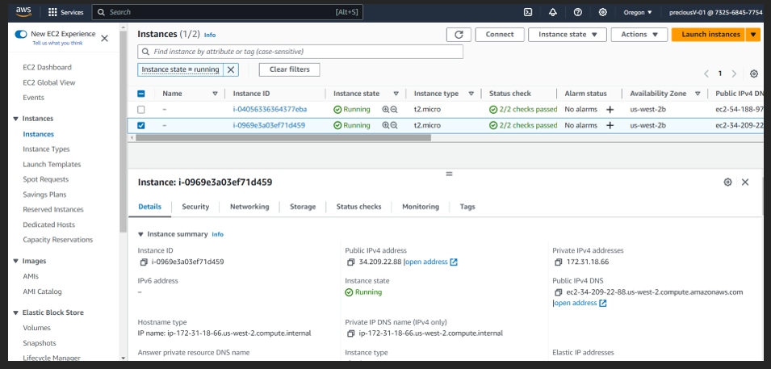

# These are the steps to launch an EC2 instance from the CLI

## Step 1: Accessed console via access keys

## Step 2: Created a key-pair via CLI

## Step 3: Created security group via CLI

## Step 4: Ran the command to Launch an EC2

## Step 5: A running instance

[FOR MORE INFO WATCH THIS VIDEO:](https://youtu.be/FivN2qgKOPY?si=ZFmMwfg-MGHwdFiJ)
